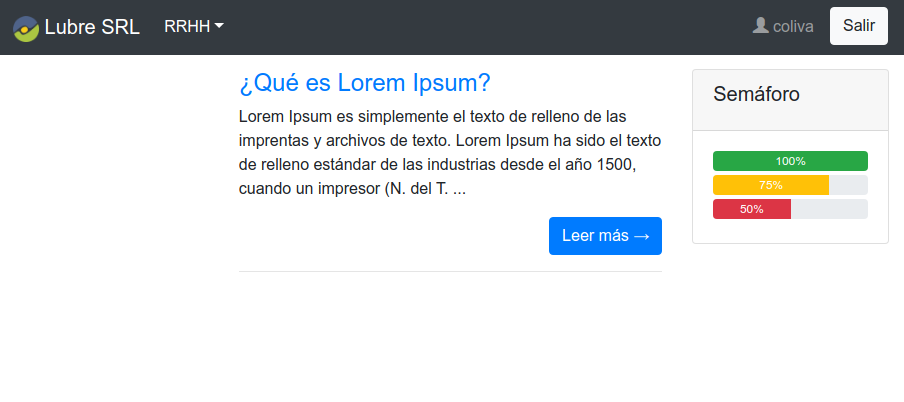

# Lubre SRL
aplicación en desarrollo ....

Desarrollo de la aplicacion web para esta empresa.

Se desarrollará utilizando Django 2.2.4 y Python 3.7

Utiliza acceso a base de datos Firebird 2.5

```
    # configuración para portatil
    'firebird_asus': {
        'ENGINE': 'django.db.backends.firebird',
        'NAME': '/databases/GESTION.FDB',
        'USER': 'SYSDBA',
        'PASSWORD': 'masterkey',
        'HOST': '172.17.0.2',
        'PORT': '3050',
        'OPTIONS': {'charset': 'ISO8859_1'}
    },
```



